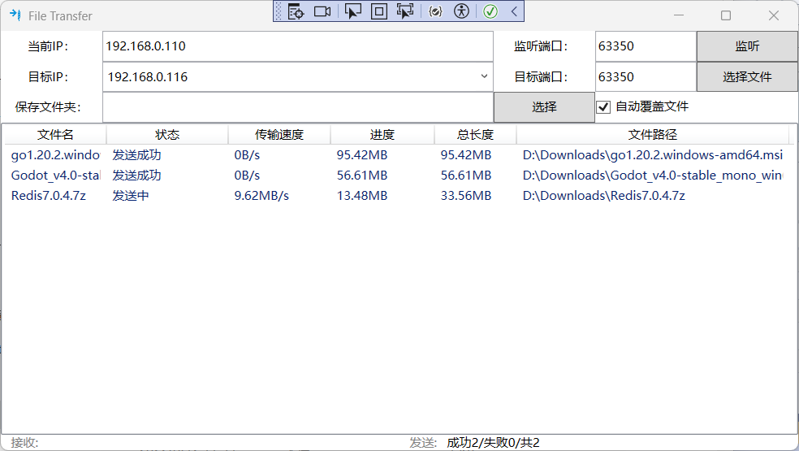

# File-Pass
 局域网内部的文件传送

 
 
 

改用maui实现多端开发，调整为聊天室样式，增加聊天室有的其他功能，增加发送文件同步功能

## Maui新版

### 功能

1. 自动添加新设备
2. 发送文本消息
3. 发送文件
4. 共享设备
5. Windows端选取文件夹、发送文件夹、同步文件夹

### 待开发功能

1. 其他系统的选取文件夹、发送文件夹、同步文件夹
2. 自适应实现MasterDetail宽屏模式，双屏或三屏模式
3. 信息加密，全局加密、单个设备加密
4. 发送语音
5. 视频通话
6. 充分考虑一方没有启动监听模式时特殊情况
7. 长按复制
8. 设备列表左滑删除
9. 消息撤回

## 一下是基于WPF旧版

### 功能介绍

简单的局域网内部文件传送。

1. 支持文件夹及多文件添加。
2. 支持多文件同时传送，但默认为单进程
3. 支持文件拖拽发送
4. 支持自动获取本地ip
5. 支持自动获取其他设备ip
6. 支持修改保存路径和重名文件跳过或覆盖

### 缺陷

1. 局域网内部所有ip获取有问题，并不能获取所有ip

### 使用方法

1. 接收方

点击 `监听` 按钮即可

2. 发送方

选择或填写 `目标IP`（即接收方ip）

点击 `选择文件` 按钮选择文件夹或拖拽文件至列表即可

### 功能待完善

1. 美化列表
2. 本地化支持