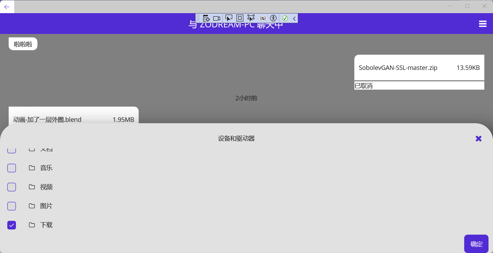

# File-Pass
 局域网内部的文件传送

 
 
 

## 功能介绍

简单的局域网内部文件传送。

1. 支持文件夹及多文件添加。
2. 支持多文件同时传送，但默认为单进程
3. 支持文件拖拽发送
4. 支持自动获取本地ip
5. 支持自动获取其他设备ip
6. 支持修改保存路径和重名文件跳过或覆盖

## 缺陷

1. 局域网内部所有ip获取有问题，并不能获取所有ip

## 使用方法

1. 接收方

点击 `监听` 按钮即可

2. 发送方

选择或填写 `目标IP`（即接收方ip）

点击 `选择文件` 按钮选择文件夹或拖拽文件至列表即可

## 功能待完善

1. 美化列表
2. 本地化支持